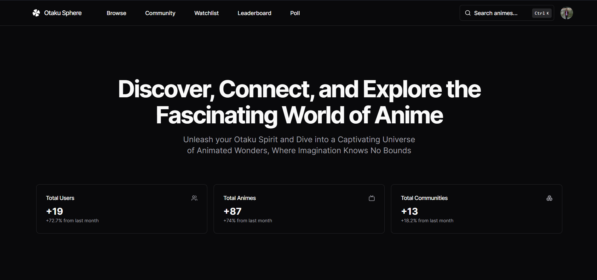

# [Otaku Sphere](https://otaku-sphere.vercel.app/)
An open source all-in-one Anime Platform build with everything in Next.js 13.

[](https://otaku-sphere.vercel.app/)

## Tech Stack

- **Framework:** [Next.js](https://nextjs.org)
- **Styling:** [Tailwind CSS](https://tailwindcss.com)
- **Authentication:** [NextAuth.js](https://next-auth.js.org/)
- **ORM:** [Prisma ORM](https://www.prisma.io/)
- **UI Components:** [shadcn/ui](https://ui.shadcn.com)
- **File Uploads:** [uploadthing](https://uploadthing.com)
- **Drag and Drop:** [react-dnd](https://react-dnd.github.io/react-dnd/about)

## Key Features

- Authentication with **NextAuth.js**
- File uploads with **uploadthing**
- ORM using **Prisma ORM**
- Database on **PlanetScale**
- Validation with **Zod**
- Drag and drop with **React-dnd**
- Admin dashboard with anime


## Running Locally

1. Clone the repository

```bash
git clone https://github.com/Sukrittt/Otaku-Sphere.git
```

2. Install dependencies using pnpm

```bash
npm install
```

3. Copy the `.env.example` to `.env` and update the variables.

```bash
cp .env.example .env
```

4. Start the development server

```bash
npm run dev
```

5. Push the database schema

```bash
npx prisma db push
```

## How do I deploy this?

Follow the deployment guides for [Vercel](https://create.t3.gg/en/deployment/vercel), [Netlify](https://create.t3.gg/en/deployment/netlify) and [Docker](https://create.t3.gg/en/deployment/docker) for more information.

## Contributing

Contributions are welcome! Please open an issue if you have any questions or suggestions. Your contributions will be acknowledged. See the [contributing guide](./CONTRIBUTING.md) for more information.

## License

Licensed under the MIT License. Check the [LICENSE](./LICENSE) file for details.
